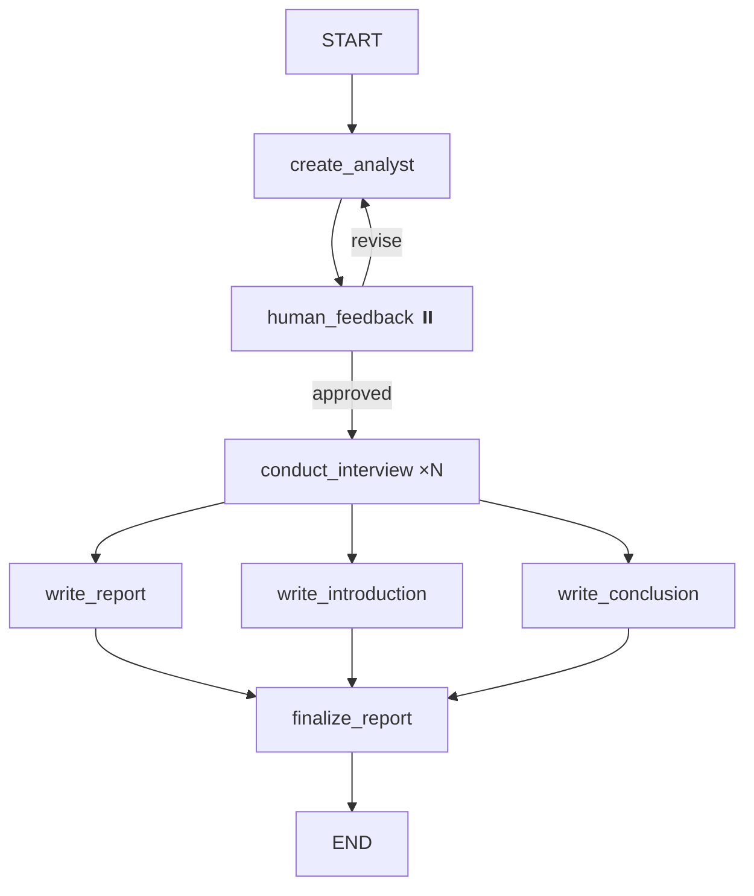

# Walkthrough — AgenticAI Report Generator Implementation

## What Was Done

Fully implemented the **Autonomous Research Report Generator** pipeline by completing four previously empty/partial files:

### Files Modified

| File | What Was Added |
|------|---------------|
| [\_\_init\_\_.py](file:///c:/AgenticAI/research_and_analyst/schemas/__init__.py) | [Analyst](file:///c:/AgenticAI/research_and_analyst/schemas/__init__.py#20-41), [Perspectives](file:///c:/AgenticAI/research_and_analyst/schemas/__init__.py#43-49), [InterviewState](file:///c:/AgenticAI/research_and_analyst/schemas/__init__.py#55-64), [ResearchGraphState](file:///c:/AgenticAI/research_and_analyst/schemas/__init__.py#66-78) |
| [\_\_init\_\_.py](file:///c:/AgenticAI/research_and_analyst/prompt_library/__init__.py) | 8 prompt templates for all LLM-driven nodes |
| [interview_workflow.py](file:///c:/AgenticAI/research_and_analyst/workflows/interview_workflow.py) | [InterviewGraphBuilder](file:///c:/AgenticAI/research_and_analyst/workflows/interview_workflow.py#22-242) — multi-turn interview sub-graph |
| [report_generator_workflows.py](file:///c:/AgenticAI/research_and_analyst/workflows/report_generator_workflows.py) | Complete [AutonomousReportGenerator](file:///c:/AgenticAI/research_and_analyst/workflows/report_generator_workflows.py#35-371) with 9 methods + bug fixes |

### Architecture



### Bug Fixes in Original [build_graph()](file:///c:/AgenticAI/research_and_analyst/workflows/report_generator_workflows.py#269-371)
- `selg.tavily_search` → `self.tavily_search`
- `.buuld()` → `.build()`
- `"Ettot"` → `"Error"`
- `ReaearchAnalystException` → [ResearchAnalystException](file:///c:/AgenticAI/research_and_analyst/exception/custom_exception.py#10-58)
- `Send` import moved from `langgraph.graph` → `langgraph.types`

## Verification Results

All syntax checks and import validations passed:

```
✅ py_compile schemas/__init__.py
✅ py_compile prompt_library/__init__.py
✅ py_compile interview_workflow.py
✅ py_compile report_generator_workflows.py
✅ import Analyst, InterviewState, ResearchGraphState, Perspectives → Schemas OK
✅ import ANALYST_CREATION_PROMPT, REPORT_WRITER_PROMPT → Prompts OK
✅ import InterviewGraphBuilder → Interview OK
✅ import AutonomousReportGenerator → Report OK
```

> [!NOTE]
> [report_service.py](file:///c:/AgenticAI/research_and_analyst/api/services/report_service.py) has a pre-existing indentation bug (methods defined at module level instead of inside [ReportService](file:///c:/AgenticAI/research_and_analyst/api/services/report_service.py#12-27)). This was not in scope and should be fixed separately.
