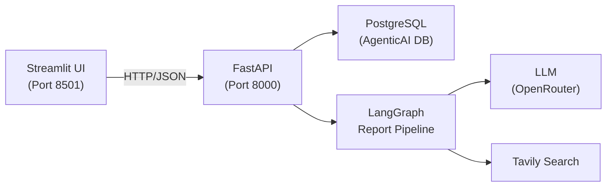

# Walkthrough — AgenticAI Report Generator

## Phase 1 — LangGraph Workflows

Implemented the core report generation pipeline:

| File | What Was Added |
|------|---------------|
| [research_schemas.py](file:///c:/AgenticAI/research_and_analyst/schemas/research_schemas.py) | [Analyst](file:///c:/AgenticAI/research_and_analyst/schemas/research_schemas.py#20-41), [Perspectives](file:///c:/AgenticAI/research_and_analyst/schemas/research_schemas.py#43-49), [InterviewState](file:///c:/AgenticAI/research_and_analyst/schemas/research_schemas.py#55-64), [ResearchGraphState](file:///c:/AgenticAI/research_and_analyst/schemas/research_schemas.py#66-78) |
| [prompts.py](file:///c:/AgenticAI/research_and_analyst/prompt_library/prompts.py) | 8 prompt templates for all LLM nodes |
| [interview_workflow.py](file:///c:/AgenticAI/research_and_analyst/workflows/interview_workflow.py) | [InterviewGraphBuilder](file:///c:/AgenticAI/research_and_analyst/workflows/interview_workflow.py#22-242) — multi-turn interview sub-graph |
| [report_generator_workflows.py](file:///c:/AgenticAI/research_and_analyst/workflows/report_generator_workflows.py) | Complete [AutonomousReportGenerator](file:///c:/AgenticAI/research_and_analyst/workflows/report_generator_workflows.py#35-406) (9 methods + bug fixes) |

---

## Phase 2 — Streamlit UI, PostgreSQL & PDF

### New/Modified Files

| File | What Was Done |
|------|--------------|
| [db_config.py](file:///c:/AgenticAI/research_and_analyst/database/db_config.py) | **[NEW]** PostgreSQL + SQLAlchemy [User](file:///c:/AgenticAI/research_and_analyst/database/db_config.py#40-50) model + hashlib auth |
| [streamlit_app.py](file:///c:/AgenticAI/research_and_analyst/streamlit_app.py) | **[NEW]** Streamlit frontend: Login → Signup → Dashboard → Report |
| [routes/\_\_init\_\_.py](file:///c:/AgenticAI/research_and_analyst/api/routes/__init__.py) | **[NEW]** REST API endpoints (auth + report operations) |
| [main.py](file:///c:/AgenticAI/main.py) | **[NEW]** FastAPI entry point with CORS + DB startup |
| [report_service.py](file:///c:/AgenticAI/research_and_analyst/api/services/report_service.py) | **[FIX]** Methods moved inside [ReportService](file:///c:/AgenticAI/research_and_analyst/api/services/report_service.py#17-182) class |
| [report_generator_workflows.py](file:///c:/AgenticAI/research_and_analyst/workflows/report_generator_workflows.py) | **[MOD]** PDF generation via fpdf2 |
| [.env](file:///c:/AgenticAI/.env) | **[MOD]** Added `DATABASE_URL` |
| [requirements.txt](file:///c:/AgenticAI/requirements.txt) | **[MOD]** Added streamlit, psycopg2-binary, fpdf2, markdown, uvicorn |

### Architecture



### Verification Results

```
✅ py_compile — all 6 files pass
✅ import db_config (User, create_tables, hash/verify_password)
✅ import api_router
✅ Streamlit 1.55.0 installed
✅ fpdf2 working
✅ PostgreSQL connected → users table created in AgenticAI DB
```

---

## How to Run

**Terminal 1 — FastAPI backend:**
```bash
python main.py
# or: uvicorn main:app --reload --port 8000
```

**Terminal 2 — Streamlit frontend:**
```bash
streamlit run research_and_analyst/streamlit_app.py
```

Then open http://localhost:8501 → Sign up → Login → Generate reports.
